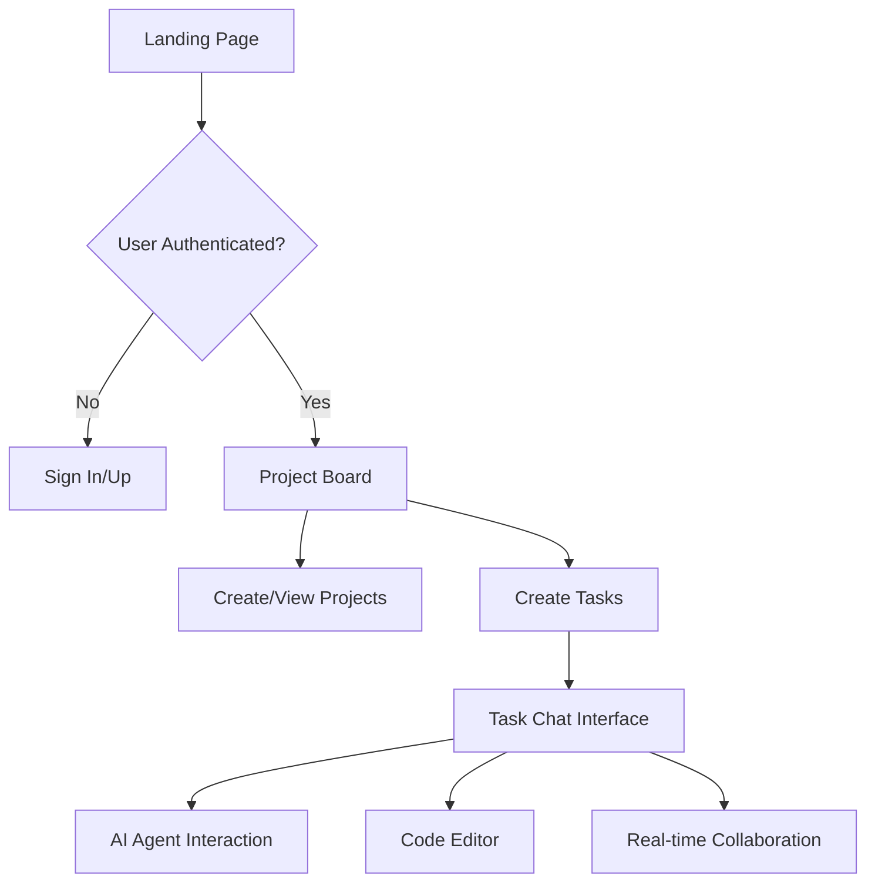

[](https://github.com/AximoxAI/orbital/actions/workflows/webpack.yml)

# Orbital - Multi-Agent SDLC Platform

A modern, AI-powered collaboration platform built with React, Vite, TypeScript, and [shadcn/ui](https://ui.shadcn.com/). Orbital provides a comprehensive workspace for software engineering teams, featuring intelligent AI agents, project management, real-time task collaboration, and productivity tools.


## 🚀 Key Features

### AI-Powered Collaboration
- **Multi-Agent Support**: Integrate with @goose, @orbital_cli, @gemini_cli, @claude_code AI agents
- **Compare and Contrast**: Generate code or fix issues and apply the best 
- **Automatic Github Sync**: Sync Code or Issues from Github
- **Real-time Task Chat**: Live collaboration with AI assistants and team members
- **Code Generation**: AI-assisted code writing, refactoring, and debugging
- **Secure Sandbox**: Use secure sandboxes for running agentic tools and code.
- **Requirements Generation**: Automatically generate project requirements from descriptions

### Project Management
- **Kanban Board**: Visual project management with drag-and-drop functionality
- **Task Management**: Create, assign, and track tasks with detailed metadata
- **Project Organization**: Multi-project workspace with team collaboration
- **Progress Tracking**: Monitor task completion and project milestones

### Development Tools
- **Integrated Code Editor**: Monaco Editor with syntax highlighting and IntelliSense
- **API Client Generation**: Auto-generated TypeScript client from OpenAPI specs
- **Real-time Logs**: Live execution logs and debugging information
- **Socket.IO Integration**: Real-time updates and collaboration features

### Enterprise-Ready
- **Authentication**: Secure user management via Clerk
- **Responsive Design**: Mobile-first, fully responsive UI
- **Type Safety**: Full TypeScript coverage across the application
- **Component Library**: Reusable shadcn/ui components with consistent design

## 🏗️ Architecture

### Frontend (React + Vite)
```
src/
├── components/
│   ├── taskChatComponents/     # Task collaboration features
│   │   ├── TaskChat.tsx        # Main chat interface
│   │   ├── LeftPanel.tsx       # Navigation sidebar
│   │   ├── LogsPanel.tsx       # Execution logs
│   │   └── MonacoCanvas.tsx    # Code editor
│   ├── apiComponents/          # API integration
│   │   ├── CreateProject.tsx   # Project creation
│   │   ├── CreateTask.tsx      # Task management
│   │   └── GenerateRequirements.tsx
│   └── ui/                     # Reusable UI components
├── pages/                      # Application routes
│   ├── Index.tsx              # Landing page
│   ├── ProjectBoard.tsx       # Main dashboard
│   ├── SoftwareEngineering.tsx # AI agents showcase
│   └── TaskChat routes        # Individual task views
├── hooks/                     # Custom React hooks
├── lib/                       # Utilities and helpers
└── api-client/               # Generated API client
```

### Backend (NestJS)
Located in `orbital-be/` - RESTful API with WebSocket support, PostgreSQL database, and AI service integrations.

## 🛠️ Tech Stack

### Frontend
- **Framework**: [React 18](https://react.dev/) with [Vite](https://vitejs.dev/)
- **Language**: [TypeScript](https://www.typescriptlang.org/)
- **Styling**: [Tailwind CSS](https://tailwindcss.com/) with CSS variables
- **UI Components**: [shadcn/ui](https://ui.shadcn.com/) + [Radix UI](https://www.radix-ui.com/)
- **State Management**: [TanStack Query](https://tanstack.com/query/latest)
- **Authentication**: [Clerk](https://clerk.com/)
- **Routing**: [React Router](https://reactrouter.com/)
- **Icons**: [Lucide React](https://lucide.dev/)
- **Code Editor**: [Monaco Editor](https://microsoft.github.io/monaco-editor/)

### Backend
- **Framework**: [NestJS](https://nestjs.com/)
- **Database**: PostgreSQL with TypeORM
- **Real-time**: Socket.IO
- **AI Integration**: OpenAI, Anthropic Claude, Google Gemini
- **API Documentation**: Swagger/OpenAPI

## 📋 Prerequisites

- **Node.js** (v18+ recommended)
- **Package Manager**: [Bun](https://bun.sh/) (recommended) or npm/yarn
- **Database**: PostgreSQL (for backend)
- **API Keys**: Clerk, OpenAI, and other AI providers

## 🚀 Getting Started

### Frontend Setup

1. **Clone the repository:**
   ```bash
   git clone https://github.com/aximoxai/orbital
   cd orbital
   ```

2. **Install dependencies:**
   ```bash
   bun install
   # or
   npm install
   ```

3. **Environment Configuration:**
   
   Copy `.env.example` to `.env` and configure:
   ```env
   VITE_CLERK_PUBLISHABLE_KEY=pk_test_your_clerk_key
   VITE_BACKEND_API_KEY=your_backend_api_key
   ```

4. **Generate API Client** (if backend is running):
   ```bash
   openapi-generator-cli generate -i swagger-spec.json -g typescript-axios -o src/api-client
   ```

5. **Start development server:**
   ```bash
   bun run dev  # Runs on http://localhost:8080
   ```

### Backend Setup

1. **Navigate to backend directory:**
   ```bash
   cd orbital-be
   ```

2. **Install dependencies:**
   ```bash
   pnpm install
   ```

3. **Configure environment variables:**
   
   Copy `orbital-be/.env.example` to `orbital-be/.env` and configure database and API keys.

4. **Start backend development server:**
   ```bash
   pnpm run start:dev  # Runs on http://localhost:3000
   ```

## 📁 Detailed Project Structure

### Core Application Flow



### Key Components

#### TaskChat System
- **Real-time messaging** with AI agents and team members
- **Code execution environment** with live logs
- **Multi-agent support** for different AI providers
- **File sharing and code snippets**

#### Project Management
- **Visual Kanban board** with drag-and-drop
- **Task lifecycle management** (TODO → In Progress → Done)
- **Team collaboration** and assignment
- **Progress analytics and reporting**

#### AI Integration
- **Context-aware conversations** with project and task context
- **Code generation and review** capabilities
- **Automated testing and documentation**
- **Requirements analysis and planning**

## 🧪 Development Scripts

### Frontend
```bash
bun run dev          # Start development server (port 8080)
bun run build        # Production build
bun run build:dev    # Development build
bun run preview      # Preview production build
bun run lint         # Run ESLint
```

### Backend
```bash
pnpm run start:dev              # Start NestJS dev server
pnpm run test                   # Run all tests
pnpm run test:watch             # Run tests in watch mode
pnpm run test -- --testNamePattern="TestName"  # Run specific test
```

## 🎨 Customization

### Theming
- **CSS Variables**: Modify `src/index.css` for global design tokens
- **Tailwind Config**: Update `tailwind.config.ts` for custom colors and spacing
- **Component Variants**: Use `class-variance-authority` for component styling

### AI Agents
- **Add new agents**: Extend `src/pages/SoftwareEngineering.tsx`
- **Custom prompts**: Configure in backend `orbital-be/src/prompts/`
- **Provider integration**: Add new AI providers in backend configuration

### UI Components
- **shadcn/ui components**: Located in `src/components/ui/`
- **Custom components**: Build on top of Radix UI primitives
- **Design system**: Consistent with CSS variables and Tailwind classes

## 🔧 API Integration

The frontend communicates with the backend through:
- **Generated TypeScript client** from OpenAPI specifications
- **Real-time Socket.IO** connections for live updates
- **TanStack Query** for efficient data fetching and caching
- **Axios interceptors** for authentication and error handling

## 🚀 Deployment

### Frontend
```bash
bun run build
# Deploy dist/ folder to your hosting platform
```

### Backend
```bash
cd orbital-be
pnpm run build
# Deploy using Docker or platform-specific deployment
```

## 🤝 Contributing

1. Fork the repository
2. Create a feature branch (`git checkout -b feature/amazing-feature`)
3. Commit your changes (`git commit -m 'Add amazing feature'`)
4. Push to the branch (`git push origin feature/amazing-feature`)
5. Open a Pull Request

## 📄 License

MIT License - see [LICENSE](LICENSE) file for details.

---

**Built with ❤️ by the Aximox team**
